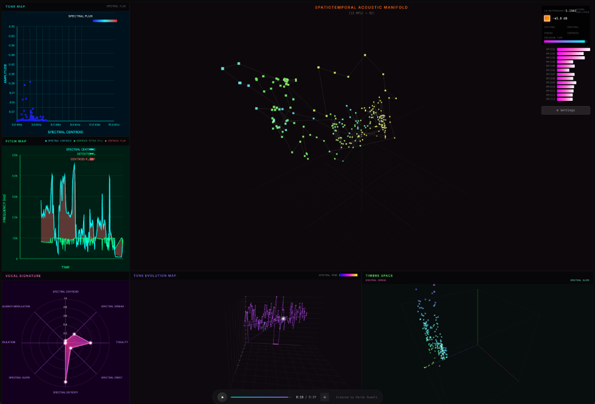

# Geometric Audio Visualizer

**Created by Mario Sumali**



A real-time audio visualization tool that transforms sound into geometric representations. Features multiple synchronized visualizations including:

- **Spatiotemporal Acoustic Manifold** - 3D MFCC-based particle visualization with PCA dimensionality reduction
- **Tone Map** - Spectral centroid vs amplitude scatter plot with spectral flux coloring
- **Pitch Map** - Time-series visualization of spectral centroid and detected pitch
- **Vocal Signature** - Radar chart showing 8 audio features in real-time
- **Tone Evolution Map** - 3D trajectory of tonality and spectral characteristics over time
- **Timbre Space** - 3D scatter plot of spectral spread, centroid, and entropy

## Usage

```bash
npm install
npm run dev
```

---

*Inspired by the work of Lucio Arese*
